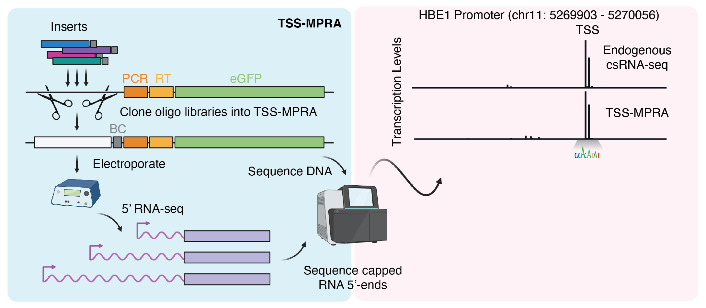

# Abstract

> ```Cis-regulatory elements can be classified by the shapes of their transcription initiation patterns, which are indicative of distinct regulatory mechanisms. While massively parallel reporter assays (MPRAs) have enabled the functional study of sequence features within regulatory elements on an unprecedented  scale, current MPRA approaches focus on quantifying transcript abundance, largely ignoring where transcription starts. This information however, could provide evidence that regulatory mechanisms in the  context of the reporter assay resemble those active in the genome. Here we describe a transcription start site-capturing massively parallel reporter assay (TSS-MPRA) that simultaneously measures the location and  frequency of transcription initiation. We characterize the degree to which plasmid-based MPRAs recapitulate endogenous initiation patterns (“TSS shapes”) and transcription levels and evaluate the effects of increasing insert length and reporter chromatinization on plasmid-derived transcription initiation. Employing a new bioinformatic approach to compare TSS shapes, we find that shorter, episomal constructs most faithfully replicate endogenous initiation patterns and transcription levels. Finally, we illustrate how TSS-MPRA can be used to decode cis-regulatory grammar by assessing the effects of core promoter and transcription factor motif mutations and single nucleotide polymorphisms on transcription initiation. Taken together, TSS-MPRA reveals important caveatsto consider when using MPRAs and enables high-resolution analysis of the sequence grammar underlying transcription initiation.```

# Introduction

> ```Recent advances in next-generation sequencing have broadened the molecular toolkit available to study the link between cis-regulatory grammar — the set of rules that govern the process by which DNA-encoded information is interpreted by transcription factors and other regulatory proteins — and regulatory element function. In particular, new methods capable of detecting transcriptional start sites (TSSs) such as CAGE, Start-seq, GRO-cap, and csRNA-seq have allowed researchers to discover and investigate previously under-appreciated features of regulatory grammar. Accordingly, the insights gained from these modern TSS-centric assays have revealed that there is valuable information encoded in the DNA within and surrounding these sites of initiation, and that changes to these sequences often leads to novel biology.```

# What?

> ```Here we compare nucleotide-resolution TSS-MPRA data from genomic inserts to the corresponding transcription initiation patterns and levels measured by csRNA-seq to characterize the similarities and differences between MPRA-derived and endogenous transcription initiation to build a better understanding of the caveats of using MPRAs to study regulatory sequence biology. We also evaluate the effects of increased insert length and reporter chromatinization status on reporter initiation patterns and transcription levels, to test typically used conditions aimed at more accurately replicating endogenous regulatory element transcription. Together, our results show the utility of TSS-MPRA to decipher the rules of transcription initiation of both promoters and enhancers, but also shed light on the limitations of MPRAs in general to study the DNA transcription regulatory function.```

# Why?

> ```Interrogating the relationship between cis-regulatory sequence and function in vivo remains difficult and low throughput largely due to the difficulties posed by editing genomic sequences in living cells. Massively parallel reporter assays (MPRAs) overcome these limitations by enabling the functional screening of thousands of sequences for regulatory activity in parallel, at the expense of dramatically reduced sequence and chromatin context. Commonly used promoter MPRA approaches only measure transcript levels while ignoring where transcription initiates, despite the fact that the location of transcription initiation is an integral characteristic of regulatory sequence activity. Consequently, it remains unclear how well MPRAs recapitulate endogenous transcription initiation patterns, thereby restricting our ability to reliably model and interpret genome sequence as well as understand the impact of DNA sequence variation on regulatory element function.```

# 1. TSS-MPRA simultaneously measures the location and frequency of transcription initiation

> ```Both enhancers and promoters start transcription from one or more TSS locations. The distribution of these initiation sites are referred to as transcription initiation patterns, or TSS shapes. Different initiation patterns have been linked to distinct regulatory mechanisms, yet TSS shape remains largely ignored in the context of MPRAs. We set out to explore the transcription initiation landscapes of regulatory sequences and compare them to their endogenous loci. To do so, we generated a reporter plasmid backbone based on the pGL4.10 plasmid used in STARR-seq. We modified the plasmid to allow for Gibson assembly cloning of synthetic oligonucleotide inserts by introducing dual homology arms flanking tandem BsaI restriction sites. We replaced the pGL4.10 luciferase 2 gene with eGFP to allow for confirmation of promoter activity by fluorescence. We then designed an oligonucleotide library comprising 500 human promoter and enhancer sequences surrounding active TSSs as determined by csRNA-seq in K562 erythroleukemia cells. Half of the sequences were randomly chosen regulatory elements covering a range of transcriptional activities and TSS shapes, the other half were sequences chosen to test the effect of mutating transcription factor or core promoter motifs and single nucleotide polymorphisms (SNPs) on initiation patterns and transcription levels. Each 200-bp synthetic sequence, or insert, in the library contained 153-bp of genomic sequence (from -110 to +42 bp around the most active TSS within a given window) and a unique 11-mer barcode as well as flanking 18-bp homology arms for directional cloning via Gibson assembly (Figure 1A). To account for potential barcode-specific effects, each sequence was barcoded 4-fold redundantly, for a total of 2000 inserts.```

## How does TSS-MPRA work?

> ```Inserts were amplified with primers against the homology arms and shotgun-cloned into our pTSS-MPRA plasmid by Gibson assembly. Plasmid pools were electroporated into K562 cells in duplicate and electroporation efficiency/viability verified by fluorescence microscopy (>80% cells eGFP+ with ~60% cell viability as measured by trypan blue exclusion). Total RNA was isolated 24 hours post electroporation. To selectively sequence capped, reporter plasmid-initiated transcripts, we performed reporter-specific 5’ RNA-seq. Briefly, non-capped RNAs were dephosphorylated with calf intestinal phosphatase, capped RNAs were decapped with RppH 5’ pyrophosphohydrolase to leave a 5’ monophosphate, a 5’ RNA adapter was ligated to the previously capped RNA 5’ ends. Plasmid-derived transcripts were then selectively reverse transcribed using a reverse transcription primer landing site encoded in the reporter transcript and PCR-amplified with Illumina-compatible primers. In parallel, we generated input DNA-seq libraries from the same cell lysates to normalize TSS-MPRA RNA signal to the plasmid levels in the cells. After sequencing, 96% of TSS-MPRA and 99% of DNA-seq reads aligned to library inserts, with 95% of inserts exhibiting quantifiable levels of transcription (defined as having >25 mapped reads). As exemplified for the sequence surrounding the HBE1 promoter locus, TSS-MPRA can capture transcription initiation frequencies and locations from synthetic inserts.```



 <p align="center">
    
 </p>
