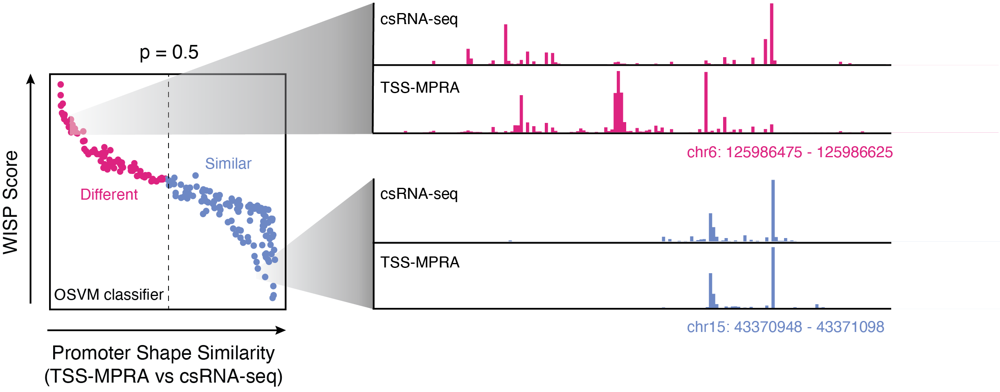
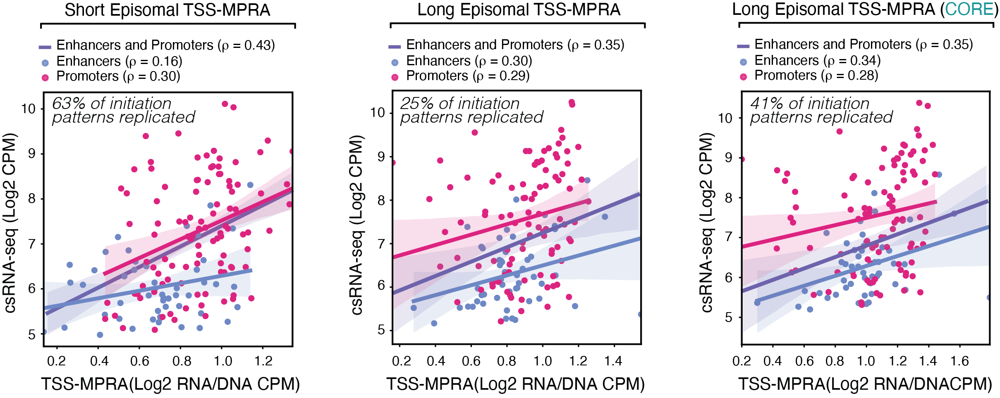
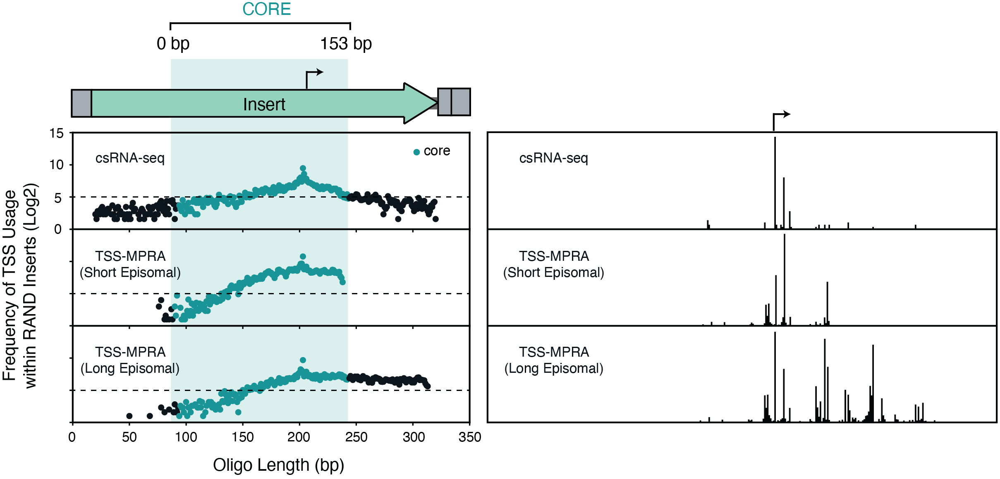
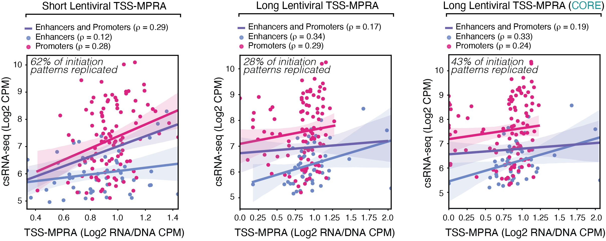
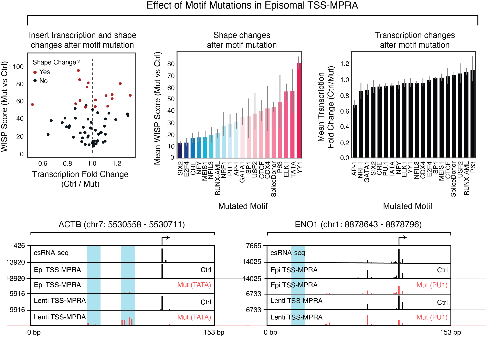

# Abstract

> ```Cis-regulatory elements can be classified by the shapes of their transcription initiation patterns, which are indicative of distinct regulatory mechanisms. While massively parallel reporter assays (MPRAs) have enabled the functional study of sequence features within regulatory elements on an unprecedented  scale, current MPRA approaches focus on quantifying transcript abundance, largely ignoring where transcription starts. This information however, could provide evidence that regulatory mechanisms in the  context of the reporter assay resemble those active in the genome. Here we describe a transcription start site-capturing massively parallel reporter assay (TSS-MPRA) that simultaneously measures the location and  frequency of transcription initiation. We characterize the degree to which plasmid-based MPRAs recapitulate endogenous initiation patterns (“TSS shapes”) and transcription levels and evaluate the effects of increasing insert length and reporter chromatinization on plasmid-derived transcription initiation. Employing a new bioinformatic approach to compare TSS shapes, we find that shorter, episomal constructs most faithfully replicate endogenous initiation patterns and transcription levels. Finally, we illustrate how TSS-MPRA can be used to decode cis-regulatory grammar by assessing the effects of core promoter and transcription factor motif mutations and single nucleotide polymorphisms on transcription initiation. Taken together, TSS-MPRA reveals important caveatsto consider when using MPRAs and enables high-resolution analysis of the sequence grammar underlying transcription initiation.```

# Introduction

> ```Recent advances in next-generation sequencing have broadened the molecular toolkit available to study the link between cis-regulatory grammar — the set of rules that govern the process by which DNA-encoded information is interpreted by transcription factors and other regulatory proteins — and regulatory element function. In particular, new methods capable of detecting transcriptional start sites (TSSs) such as CAGE, Start-seq, GRO-cap, and csRNA-seq have allowed researchers to discover and investigate previously under-appreciated features of regulatory grammar. Accordingly, the insights gained from these modern TSS-centric assays have revealed that there is valuable information encoded in the DNA within and surrounding these sites of initiation, and that changes to these sequences often leads to novel biology.```

# What?

> ```Here we compare nucleotide-resolution TSS-MPRA data from genomic inserts to the corresponding transcription initiation patterns and levels measured by csRNA-seq to characterize the similarities and differences between MPRA-derived and endogenous transcription initiation to build a better understanding of the caveats of using MPRAs to study regulatory sequence biology. We also evaluate the effects of increased insert length and reporter chromatinization status on reporter initiation patterns and transcription levels, to test typically used conditions aimed at more accurately replicating endogenous regulatory element transcription. Together, our results show the utility of TSS-MPRA to decipher the rules of transcription initiation of both promoters and enhancers, but also shed light on the limitations of MPRAs in general to study the DNA transcription regulatory function.```

# Why?

> ```Interrogating the relationship between cis-regulatory sequence and function in vivo remains difficult and low throughput largely due to the difficulties posed by editing genomic sequences in living cells. Massively parallel reporter assays (MPRAs) overcome these limitations by enabling the functional screening of thousands of sequences for regulatory activity in parallel, at the expense of dramatically reduced sequence and chromatin context. Commonly used promoter MPRA approaches only measure transcript levels while ignoring where transcription initiates, despite the fact that the location of transcription initiation is an integral characteristic of regulatory sequence activity. Consequently, it remains unclear how well MPRAs recapitulate endogenous transcription initiation patterns, thereby restricting our ability to reliably model and interpret genome sequence as well as understand the impact of DNA sequence variation on regulatory element function.```

# 1. TSS-MPRA simultaneously measures the location and frequency of transcription initiation

> ```Both enhancers and promoters start transcription from one or more TSS locations. The distribution of these initiation sites are referred to as transcription initiation patterns, or TSS shapes. Different initiation patterns have been linked to distinct regulatory mechanisms, yet TSS shape remains largely ignored in the context of MPRAs. We set out to explore the transcription initiation landscapes of regulatory sequences and compare them to their endogenous loci. To do so, we generated a reporter plasmid backbone based on the pGL4.10 plasmid used in STARR-seq. We modified the plasmid to allow for Gibson assembly cloning of synthetic oligonucleotide inserts by introducing dual homology arms flanking tandem BsaI restriction sites. We replaced the pGL4.10 luciferase 2 gene with eGFP to allow for confirmation of promoter activity by fluorescence. We then designed an oligonucleotide library comprising 500 human promoter and enhancer sequences surrounding active TSSs as determined by csRNA-seq in K562 erythroleukemia cells. Half of the sequences were randomly chosen regulatory elements covering a range of transcriptional activities and TSS shapes, the other half were sequences chosen to test the effect of mutating transcription factor or core promoter motifs and single nucleotide polymorphisms (SNPs) on initiation patterns and transcription levels. Each 200-bp synthetic sequence, or insert, in the library contained 153-bp of genomic sequence (from -110 to +42 bp around the most active TSS within a given window) and a unique 11-mer barcode as well as flanking 18-bp homology arms for directional cloning via Gibson assembly. To account for potential barcode-specific effects, each sequence was barcoded 4-fold redundantly, for a total of 2000 inserts. I refer to this oligo pool as epi-short throughout the text.```


## How does TSS-MPRA work?

> ```Epi-short inserts were amplified with primers against the homology arms and shotgun-cloned into our pTSS-MPRA plasmid by Gibson assembly. Plasmid pools were electroporated into K562 cells in duplicate and electroporation efficiency/viability verified by fluorescence microscopy (>80% cells eGFP+ with ~60% cell viability as measured by trypan blue exclusion). Total RNA was isolated 24 hours post electroporation. To selectively sequence capped, reporter plasmid-initiated transcripts, we performed reporter-specific 5’ RNA-seq. Briefly, non-capped RNAs were dephosphorylated with calf intestinal phosphatase, capped RNAs were decapped with RppH 5’ pyrophosphohydrolase to leave a 5’ monophosphate, a 5’ RNA adapter was ligated to the previously capped RNA 5’ ends. Plasmid-derived transcripts were then selectively reverse transcribed using a reverse transcription primer landing site encoded in the reporter transcript and PCR-amplified with Illumina-compatible primers. In parallel, we generated input DNA-seq libraries from the same cell lysates to normalize TSS-MPRA RNA signal to the plasmid levels in the cells. After sequencing, 96% of TSS-MPRA and 99% of DNA-seq reads aligned to library inserts, with 95% of inserts exhibiting quantifiable levels of transcription (defined as having >25 mapped reads). As exemplified for the sequence surrounding the HBE1 promoter locus, TSS-MPRA can capture transcription initiation frequencies and locations from synthetic inserts.```

# 2. We used TSS-MPRA to characterize the degree to which plasmid-based MPRAs recapitulate endogenous transcription initiation



## Determining changes in transcription initiation patterns using windowed initiation shape profiles (WISP) scores

> ```To assess the degree to which TSS-MPRA mirrors endogenous transcription initiation patterns, we developed a “windowed initiation shape profile”  (WISP) score. WISP scores quantify the degree of dissimilarity between two initiation patterns by summing up the weighted differences in relative magnitude of the initiation signal at each nucleotide position within sliding windows of increasing size (up to 5 nucleotides) across a region. To determine when two TSS shapes can be considered significantly different based on WISP score, we trained a novelty detection model on replicate csRNA-seq experiments, using the WISP scores and average expression levels for all gene promoters to experimentally define dispersion between biological replicates.```

## An brief explaination of our WISP score and outlier detection model

> ```We developed windowed initiation shape profile scores (WISP) to describe the dissimilarity between two transcription initiation patterns. It compares the position-specific initiation levels between two data sets. The algorithm employs a sliding window approach to scan across two given TSS distributions and then sums up the absolute differences in relative initiation signal for each window. This is done for increasing window sizes, starting with a size of 1. The sum of the combined differences at each window size multiplied by the window size makes up the WISP score, which sensitively quantifies the degree of divergence between two TSS shapes. Computationally, TSS distributions are represented as 1-D arrays of identical length (WISP scores can not be calculated for arrays of different lengths). Each value in the array represents the position-specific raw signal (here: 5’ RNA-seq sequencing reads that map to that nucleotide position within the TSS distribution). Raw values are CPM-transformed to account for sequencing depth differences between experiments. Arrays are further normalized so that all values within the array sum up to one. This ensures that comparisons between arrays are independent of overall signal intensity. Dissimilarity between two 1-D arrays is computed by sliding a window of length k across both arrays, calculating the absolute differences in normalized array values at each window and adding them to a running k-diff score. Each final k-diff score is multiplied by the length of the window (k) and then added to a diff score. This process is repeated a total of k times (k = 5 in this manuscript). The final diff score computed after this iterative process is equivalent to the WISP score. WISP scores are a useful metric to quantify how different two TSS distributions are, but by themselves are not enough to determine whether two distributions are significantly different or not. Therefore, to determine whether two TSS distributions are significantly different from each other, we used csRNA-seq replicate datasets to build a novelty detection model. Our assumption was that there should be some minimal variation in TSS distribution between identical gene promoters in any two replicates, and that any large differences outside of that natural variation could be considered as outliers. We first examined the 300 bp surrounding annotated transcription start sites (-150/+150) and quantified TSS frequencies as described previously. We calculated WISP scores for identical gene promoters between two replicates (after promoters with < 25 reads were filtered out). We then trained a one-class support vector machine (OCSVM) model (19) on the WISP scores and mean quantile-normalized RNA abundance counts from each promoter replicate. Using this novelty detection model we can determine whether a new data point (WISP score and mean quantile-normalized RNA abundances between any two TSS distributions) is a member of a specific class or not (i.e. significantly different from the normal variation observed in replicate datasets or not). The output of our model is a probability of the new data point being an outlier (where 0 is completely within the normal variation observed between replicate datasets, and 1 is completely outside), wherein data points closer to 1 represent two significantly different TSS distributions. For most purposes, unless stated otherwise, we assume that any two TSS distributions with a greater than 0.5 probability of being an outlier are considered to be significantly different.```

## Why not a more commonly used similarity metric like Earth Movers Distance (EMD) that is already more established in the transcription initiation field?

> ```The short answer is that EMD doesn't work as well as WISP. Using barcode replicates as gold standards we find that WISP tends to group 51% of barcode replicates as the most similar sequences while EMD only groups 15% of them.```

# 3. We find that shorter, episomal constructs more faithfully recapitulate endogenous transcription initiation

## TSS-MPRA insert expression correlates well with endogenous transcription initiation



> ```To determine how well TSS-MPRA output reflects endogenous transcription initiation levels, we compared reporter and csRNA-seq expression levels of the 250 randomly chosen regulatory elements in our epi-short oligo pool. TSS-MPRA and csRNA-seq signals were substantially correlated (Spearman’s rho = 0.43, Pearson’s r = 0.44), in line with previously observed levels of correlation between SuRE-seq (a non-TSS-shape-aware promoter MPRA) and GRO-cap nascent transcription initiation data (Pearson’s r = 0.43). Segregating our results by promoter and enhancer annotation revealed that promoters had higher levels of correlation with csRNA-seq than enhancers, suggesting that proper enhancer transcription may be more dependent on sequence features not embedded within the short, 153-bp pieces of genomic sequence tested (Promoter Spearman’s rho = 0.30, Enhancer Spearman’s rho = 0.16).```

## Plasmid-based reporters do a decent job of capturing endogenous transcription initiation patterns, but almost half of inserts tested displayed inaccurate initiation patterns in our reporter

> ```WISP score analysis of TSS-MPRA insert and csRNA-seq data showed that 63% of the 250 randomly chosen regulatory elements in our epi-short oligo pool drove highly similar or identical transcription initiation patterns as their corresponding endogenous genomic loci. The 37% of inserts that did not recapitulate endogenous TSS shapes tended to have more dispersed initiation patterns and lower levels of transcription. Cumulative TSS-centered analysis of the nucleotide frequencies surrounding TSS showed that TSS-MPRA inserts that recapitulated endogenous TSS shapes exhibited nucleotide frequency patterns consistent with Initiator and upstream TATA box motif enrichment. This was also apparent for TSS-MPRA-specific TSSs located in inserts with TSS shapes that differed from the endogenous TSS shapes. In contrast, csRNA-seq-specific TSS within regions where the corresponding TSS-MPRA inserts did not recapitulate the endogenous TSS shape had an overall more pyrimidine-rich profile upstream, including at the TATA box location at -30 nt, and a bias for G rather than the typical A nucleotides as the first transcribed nucleotide. The transcription levels of inserts with lower WISP scores (i.e. more accurate initiation patterns) correlated better with endogenous transcription levels than sequences with higher WISP scores, suggesting that TSS shape and transcription levels are related. These findings highlight that while the majority of sequences in our TSS-MPRA drive accurate initiation patterns, a large percentage of tested sequences give rise to divergent TSS shapes, indicating that these elements may use alternative regulatory mechanisms when in the context of a reporter plasmid.```

## Commonly prescribed remedies for more accurate regulatory element function such as chromatinization and longer insert length did not lead to more endogenous-like transcription initiation of inserts

## Increasing the size of sequence inserts in an MPRA does not lead to more accurate initiation patterns or expression levels



> ```In line with core promoter sequences (-40 to +40 from the TSS) being sufficient to determine where transcription initiates, the 153-bp genomic sequence inserts surrounding the endogenous TSS were enough to replicate the majority of endogenous initiation patterns in our epi-short TSS-MPRA experiments. On the other hand, enhancer MPRAs have shown that extending the size of inserts leads to increased enhancer activity. It is well known that enhancer activity and enhancer transcription are strongly correlated. While TSS-MPRA measures transcription instead of enhancer function, we wondered whether increasing TSS-MPRA insert size would also lead to more accurate initiation patterns and transcription levels. To this end, we generated a second, longer oligonucleotide library (epi-long), derived from the 250 randomly chosen regulatory element locations from our epi-short oligo pool. Each insert in our epi-long library consisted of longer 350-bp sequences that contained the original 153-bp sequence plus 75-bp of additional genomic sequence on either side, for a total of 303-bp of genomic sequence, downstream barcodes and flanking homology arms for Gibson assembly as described above. Each genomic insert sequence was barcoded 2-fold redundantly, for a total of 500 inserts. Comparison of the TSS-MPRA initiation patterns driven by epi-long and the corresponding endogenous sequences measured by csRNA-seq revealed that increasing the size of our inserts led to a dramatic decline in TSS-MPRA-recapitulated initiation patterns (from 63% seen in epi-short experiments to 25%). Notably, increasing the insert sequence size led to the appearance of a large number of TSSs not observed in the corresponding csRNA-seq data. These non-endogenous TSSs were found outside and largely downstream of the 153-bp ‘core’ sequence used in our epi-short pool. Restricting our WISP analysis to the 153-bp core region of epi-long sequences increased the percentage of inserts with similar initiation patterns to their endogenous loci from 25% to 41%. This decrease in TSS-MPRA-recapitulated endogenous initiation patterns was accompanied by a drop in correlation between epi-long and csRNA-seq transcription levels (epi-short: Spearman’s rho = 0.43, epi-long: Spearman’s rho = 0.35). Here, limiting our analysis to ‘core’ regions did not improve correlation between epi-long and csRNA-seq transcription levels (Spearman's rho = 0.35). Surprisingly, when dividing TSS-MPRA inserts into enhancers and promoters, enhancer, but not promoter, insert transcription levels correlated better with endogenous transcription levels with increased insert size. This suggests that accurate enhancer transcription (and potentially function) may rely on additional sequence information encoded within longer stretches of genomic DNA than promoters.```


## Chromatinization reporter constructs leads to large changes in transcription levels, but not initiation patterns



> ```Studies comparing transiently transfected with chromatinized transcription reporters have suggested that lentivirally integrated reporters are more reflective of endogenous cis-regulatory activity. We were curious whether chromatinization of TSS-MPRA would similarly lead to more endogenous-like reporter transcription initiation patterns and levels. To this end, we adapted a lentiviral MPRA reporter plasmid for Gibson assembly, used it to clone our short and long oligo pools and lentivirally integrated these pooled libraries into the genome of K562 cells. Analysis of lenti-TSS-MPRA data revealed that 62% of sequences in our lenti-short experiments mirrored their endogenous initiation patterns, which dropped to 28% for lenti-long libraries. These results resembled the observations from episomal constructs (63% and 25% respectively, with episomal and chromatinized reporters sharing the majority of inserts recapitulating csRNA-seq TSS shapes), suggesting that the influence of chromatinization on ‘proper’ transcription initiation shape — at least in the context of a lentiviral backbone randomly integrated into the genome — is minimal. In contrast, genomic integration of both pools drastically decreased the correlation between lenti-TSS-MPRA and endogenous transcription activity when compared to episomal experiments (lenti-short Spearman’s rho = 0.29, lenti-long Spearman’s rho = 0.17). These observations show that the regulatory mechanisms driving TSS shape in episomal and chromatinized elements are likely quite similar and that regardless of insert length, chromatinization negatively impacts the ability of the TSS-MPRA to model endogenous transcription levels.```

# 4. TSS-MPRA can be used to study the effect of motif mutations and SNPs on transcription initiation

## TSS-MPRA can be used to study the effect of motif mutations on initiation patterns and transcription levels



> ```To demonstrate the utility of TSS-MPRA for decoding regulatory grammar, we used our method to analyze the effects of mutating core promoter and transcription factor motifs on the initiation patterns and transcription levels of cis-regulatory elements. We focused on a subset of 21 regulatory motifs enriched in K562-transcribed or accessible regulatory elements (as determined by csRNA-seq and DNase-seq respectively). Altogether, the epi-short library contained 47 control sequences that harbored various combinations of core promoter and transcription factors motifs, and 71 mutated sequences where all instances of a given motif in a control sequence were replaced with a sequence that does not match any known transcription factor motifs. Each sequence was barcoded 4-fold redundantly for a total of 188 control and 284 mutated inserts. Despite the small overall number of sequences studied, DNA motif mutations induced clearly visible, significant initiation pattern changes in 25% of regulatory elements when mutating all instances of the respective DNA motif.  Most of these changes were the result of mutating a small number of motifs (Elk1, YY1, TATA-box), while other mutations in other motifs caused either minimal or varied effects. In contrast, motif mutations only modestly affected insert transcription levels, with mutations in AP-1 and p63 motifs having the largest impact. Reporter chromatinization increased the fraction of inserts with significantly transformed TSS shapes to 40%. Interestingly, we found that mutations in motifs for the Ets factor PU.1 led to larger WISP scores (indicative of more significant changes in initiation pattern) only when the reporter library was properly chromatinized, consistent with its known role in chromatin opening. Similar to the results in the episomal setting, motif mutations had a minimal effect on transcription levels of chromatinized inserts. The large impact of TATA-box mutations on initiation patterns in both episomal and chromatinized contexts corroborates its well-known role in positioning the pre-initiation complex and RNAPII to initiate transcription. These results highlight the value of TSS-MPRA to investigate cis-regulatory grammar, to gain an understanding of how transcription factor binding sites contribute to both activity levels and initiation site usage of regulatory sequences.```

## TSS-MPRA can be used to study the effect of single-nucleotide polymorphisms on initiation patterns and transcription levels


> ```Given that >80% of disease-associated genetic variants reside within non-coding regions with likely gene-regulatory activity, it is essential for their interpretation to better understand how these SNPs impact regulatory function. To test the degree to which TSS-MPRA can be used to study the influence of SNPs on transcription initiation patterns and levels, we analyzed the effect of 45 SNPs from the GWAS catalog that overlapped regulatory elements transcribed in K562 cells on transcription initiation. Three of the SNPs tested (~7%) led to dramatic changes in TSS shape in episomal TSS-MPRA. Reporter chromatinization increased the number of SNPs that led to significantly different initiation patterns to 6 (~14%). As an example, the SNP rs1991401, which is associated with myopia, asthma and blood traits, leads to a mutated TATA-box in the promoter of the DDX5 gene. TSS-MPRA results of inserts harboring the rs1991401 variant shows a drastic shift to a dispersed initiation phenotype that is consistent with the loss of TATA-box function. Similarly, SNP rs131804, which is also associated with blood traits, causes a mutation 2 bp upstream of the primary TSS in the SCO2 gene, leading to a substantial change in initiation site usage and higher overall levels of TSS-MPRA activity. Though the number of SNPs examined in this study is small, our results demonstrate that TSS-MPRA has the power to identify variants associated with extreme changes in initiation patterns, which provides additional context and insight into their potential regulatory impact that may be missed when using conventional MPRA approaches.```

# Conclusions

> ```The TSS-detecting aspect of TSS-MPRA permitted a direct comparison of reporter-driven transcription initiation to genome-driven transcription initiation, to gain insight into how well MPRAs   recapitulate endogenous transcription initiation in general. We observed a high correlation between TSS-MPRA and endogenous transcription levels (Pearson’s r = 0.44), in line with results from a prototypical MPRA that uses 3’ barcodes (SuRE-seq, Pearson’s r = 0.43). While 63% of synthetic inserts drove endogenous initiation patterns, 37% of them showed divergent TSS shapes despite containing identical genomic sequences as the endogenous loci. We observe that inserts with dramatically larger WISP scores (meaning more inaccurate TSS shapes) have poorer correlation with endogenous transcription levels than inserts with lower WISP scores (meaning more accurate/endogenous TSS shapes). This brings into question whether the inaccurate transcription initiation of these regulatory sequences is governed by the same mechanisms in reporter and native contexts. In an effort to more accurately replicate endogenous initiation patterns and transcription levels we increased the size of our synthetic sequence inserts and chromatinized our reporter using lentivirus. Surprisingly, both endogenous TSS shape and transcriptional activity were more faithfully recapitulated by shorter, episomal reporter constructs. Increased insert length frequently led to visually divergent TSS shapes, driven by the initiation of additional non-endogenous transcription downstream of the most active TSS. In contrast, reporter chromatinization led to large changes in transcription that strongly reduced the overall correlation between TSS-MPRA and csRNA-seq transcript levels, with minimal alterations to initiation patterns. Taken together, our results indicate that the mechanisms governing transcription initiation at episomal and lentivirally integrated elements are likely similar for the majority of inserts, and that chromatin context largely acts as a modifier of transcription levels, in line with previous work. At the same time, our findings also highlight important caveats when studying cis-regulatory element mechanisms by MPRAs.  Enhancers and promoters are both transcribed and share similar core promoter elements and transcription factor motifs, yet the distinguishing characteristics that determine their different functions are still poorly understood (39). Extending the size of our synthetic inserts from 153-bp to 303-bp of genomic sequence increased the correlation of enhancers with endogenous transcription levels, but not that of promoter inserts. This finding indicates that enhancer transcription, and possibly function, is more dependent on information content encoded in larger stretches of regulatory sequence than promoters. Future studies using multiplex pairwise assembly to generate even longer insert libraries will be necessary to further characterize the relationship between sequence length and enhancer transcription. Chromatinization of TSS-MPRA resulted in large overall changes in insert transcription levels, ultimately leading to lower levels of correlation with endogenous activity, but had little effect on the initiation patterns driven by our inserts. Further work will be necessary to determine how enhancer transcription and function relate to each other in episomal and chromosomal settings, and to characterize the role of the genomic and reporter sequence environment. Overall, our data demonstrates that TSS-MPRA is a valuable tool to study regulatory grammar, including understudied promoter features such as the effect of promoter sequence on TSS shape.```

# Can TSS-MPRA be used to measure enhancer activity?

> ```TSS-MPRA is most similar to promoter-based MPRAs in which transcription and transcription start site (TSS) location is the output. However, our lab has recently developed have a version of TSS-MPRA that measures both the promoter and enhancer potential of a set of sequences simultaneously!```

# Interested in learning more, getting in touch, or using TSS-MPRA on a collaboration? Contact me!

> ```cag104@eng.ucsd.edu```
